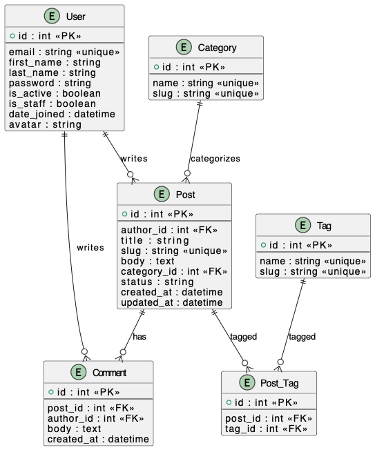

# blog-api

REST API for a blog with JWT authentication, Redis caching, and rate limiting.

## ERD

## Features

- Custom user model with email authentication
- JWT authentication
- Blog posts with categories and tags
- Comments on posts
- Rate limiting with Redis
- Caching with Redis
- Pub/Sub for new comments
- Comprehensive logging

## Setup

1. Clone repository
2. Create virtual environment
3. Install dependencies: `pip install -r requirements/dev.txt`
4. Copy `.env.example` to `.env` and configure
5. Run migrations: `python manage.py migrate`
6. Create superuser: `python manage.py createsuperuser`
7. Run server: `python manage.py runserver`

## API Endpoints

### Auth
- POST /api/auth/register/ - Register new user
- POST /api/auth/token/ - Login (get tokens)
- POST /api/auth/token/refresh/ - Refresh access token

### Posts
- GET /api/posts/ - List published posts
- POST /api/posts/ - Create post (auth)
- GET /api/posts/{slug}/ - Get post
- PATCH /api/posts/{slug}/ - Update post (owner)
- DELETE /api/posts/{slug}/ - Delete post (owner)
- GET /api/posts/{slug}/comments/ - List comments
- POST /api/posts/{slug}/comments/ - Add comment (auth)

## Rate Limits
- Register: 5/minute per IP
- Login: 10/minute per IP
- Create post: 20/minute per user