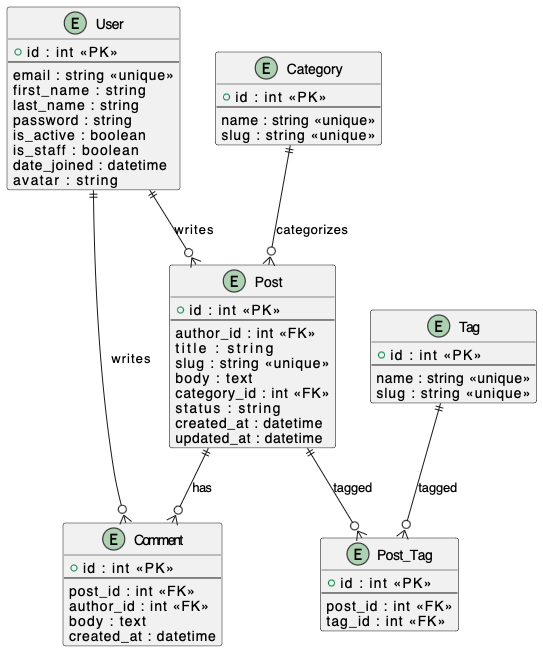

# blog-api

REST API for a blog with JWT authentication, Redis caching, and rate limiting.

## ERD



## Features

- Custom user model with email authentication
- JWT authentication
- Blog posts with categories and tags
- Comments on posts
- Rate limiting with Redis
- Caching with Redis
- Pub/Sub for new comments
- Comprehensive logging

## Setup

1. Clone repository
2. Create virtual environment
3. Install dependencies: `pip install -r requirements/dev.txt`
4. Copy `.env.example` to `.env` and configure
5. Run migrations: `python manage.py migrate`
6. Create superuser: `python manage.py createsuperuser`
7. Run server: `python manage.py runserver`

## API Endpoints

### Auth
- POST /api/auth/register/ - Register new user
- POST /api/auth/token/ - Login (get tokens)
- POST /api/auth/token/refresh/ - Refresh access token

### Posts
- GET /api/posts/ - List published posts
- POST /api/posts/ - Create post (auth)
- GET /api/posts/{slug}/ - Get post
- PATCH /api/posts/{slug}/ - Update post (owner)
- DELETE /api/posts/{slug}/ - Delete post (owner)
- GET /api/posts/{slug}/comments/ - List comments
- POST /api/posts/{slug}/comments/ - Add comment (auth)

## Rate Limits
- Register: 5/minute per IP
- Login: 10/minute per IP
- Create post: 20/minute per user

## HW4 — Verification

Run the steps below after `docker compose up --build` finishes.

### 1. nginx is the entry point

```bash
curl -I http://localhost/admin/login/
```

Expected: `HTTP/1.1 200 OK` plus a `Server: nginx/...` header.

### 2. Static files are served by nginx with long cache

```bash
curl -I http://localhost/static/admin/css/base.css
```

Expected: `HTTP/1.1 200 OK` and `Cache-Control: public, max-age=2592000`.

### 3. JSON API works through the proxy

```bash
curl http://localhost/api/posts/
```

Expected: paginated JSON list of published posts.

### 4. nginx returns 502 when the upstream is down

```bash
docker compose stop web
curl -I http://localhost/api/posts/
```

Expected: `HTTP/1.1 502 Bad Gateway` returned by nginx (NOT a connection
refused error, which would mean nginx itself was the one missing).

Restore:

```bash
docker compose start web
```

### 5. Daphne is no longer reachable from the host

```bash
curl http://localhost:8000/
```

Expected: `curl: (7) Failed to connect to localhost port 8000: Connection refused`.

### 6. WebSocket upgrade works through nginx

```bash
# Get a JWT first:
TOKEN=$(curl -s -X POST http://localhost/api/auth/token/ \
    -H 'Content-Type: application/json' \
    -d '{"email": "user@example.com", "password": "password"}' \
    | python -c 'import sys, json; print(json.load(sys.stdin)["access"])')

# Connect:
wscat -c "ws://localhost/ws/posts/<existing-slug>/comments/?token=$TOKEN"
```

Expected: `Connected (press CTRL+C to quit)` (i.e. nginx returned
`101 Switching Protocols`).  Posting a comment via the REST API in another
terminal should produce a JSON message in the wscat session.

## Project layout

```
.
├── apps/
│   ├── blog/
│   ├── notifications/
│   ├── users/
│   └── core/
├── docker-compose.yml      # adds nginx (hw4)
├── Dockerfile
├── nginx/
│   └── default.conf        # site config (hw4)
├── requirements/
├── scripts/
│   └── entrypoint.sh
├── settings/
│   ├── base.py
│   ├── env/
│   │   ├── local.py
│   │   └── prod.py         # DEBUG=False, ALLOWED_HOSTS includes localhost
│   ├── celery.py
│   ├── asgi.py
│   └── wsgi.py
└── README.md
```